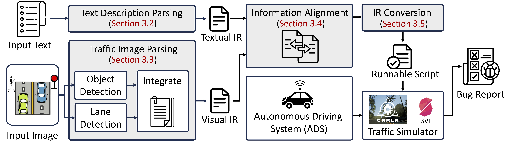

# TrafficComposer
The official repo for the FSE 2025 paper "Multi-modal Traffic Scenario Generation for Autonomous Driving System Testing".

[Project Homepage](https://hcss.cs.purdue.edu/trafficcomposer/) | [GitHub](https://github.com/TrafficComposer/TrafficComposer/)

<p align="center">
  
</p>

## Cite
```
@article{tu2025trafficcomposer,
  title={Multi-modal Traffic Scenario Generation for Autonomous Driving System Testing},
  author={Tu, Zhi and Niu, Liangkun and Fan, Wei and Zhang, Tianyi},
  journal={Proceedings of the ACM on Software Engineering},
  year={2025},
  number={FSE},
  publisher={ACM New York, NY, USA},
}
```
